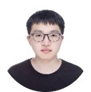
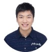
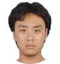

---
# Leave the homepage title empty to use the site title
title:
date: 2022-10-24
type: landing

sections:
#  - block: markdown
#    id: imghead
#    content:
#      title: |-
#        **WestLake Nlp Lab**
#      subtitle: ''
#      text:
#        
Lexical, syntactic and semantic representation and analysis in Chinese and English basic natural language processing.
#        

#    design:
#      spacing:
#        # Customize the section spacing. Order is top, right, bottom, left.
#        padding: ["150px", "0", "150px", "0"]
#      background:
#        color: black
#        text_color_light: true
#        image:
#          # Add your image background to `assets/media/`.
#          filename: ww.jpg
#          filters:
#            brightness: 0.4
#          size: cover
#          position: center
#          parallax: false
  - block: hero
    id: introduction
    content:
      title: 
        WestLakeNLP
      image:
        filename: sch.jpg
      text: |-
        Dr. Zhang's main research interests are natural language processing, machine learning and text mining, working on machine learning and inference algorithms for structural prediction, statistical parsing, Chinese syntactic processing, text generation, machine translation, text summarization, dialogue system, information extraction, sentiment analysis and financial market predication.

#        **Current Research Interest**
#        

#        + natural language processing
#        + artificial intelligence
#        
#  - block: about.avatar
#    id: about
#    content:
      # Choose a user profile to display (a folder name within `content/authors/`)
#      username: admin
      # Override your bio text from `authors/admin/_index.md`?
#      text:
  - block: collection
    id: posts
    content:
      title: 
        Recent News
      subtitle: ''
      text: ''
      # Choose how many pages you would like to display (0 = all pages)
      count: 2
      # Filter on criteria
      filters:
        folders:
          - post
        author: ""
        category: ""
        tag: ""
        exclude_featured: false
        exclude_future: false
        exclude_past: false
        publication_type: ""
      # Choose how many pages you would like to offset by
      offset: 0
      # Page order: descending (desc) or ascending (asc) date.
      order: desc
    design:
      # Choose a layout view
      view: compact
      columns: '2'
#  - block: portfolio
#    id: projects
#    content:
#      title: Projects
#      filters:
#        folders:
#          - project
      # Default filter index (e.g. 0 corresponds to the first `filter_button` instance below).
#      default_button_index: 0
      # Filter toolbar (optional).
      # Add or remove as many filters (`filter_button` instances) as you like.
      # To show all items, set `tag` to "*".
      # To filter by a specific tag, set `tag` to an existing tag name.
      # To remove the toolbar, delete the entire `filter_button` block.
#      buttons:
#        - name: All
#          tag: '*'
#        - name: Deep Learning
#          tag: Deep Learning
#        - name: Other
#          tag: Demo
#    design:
      # Choose how many columns the section has. Valid values: '1' or '2'.
#      columns: '1'
#      view: showcase
      # For Showcase view, flip alternate rows?
#      flip_alt_rows: false
  - block: markdown
    id: people
    content:
      title: |-
        People
      subtitle: ''
      # Choose a user profile to display (a folder name within `content/authors/`)
      # Override your bio text from `authors/admin/_index.md`?
      text: |-
        ## Faculty
        <table width="100%" align="center">
            <tr>
                <td align="center" style="margin-bottom:40px"><h4><a href="https://frcchang.github.io/" style="text-decoration: none;">Zhang Yue</a></h4>Tenured Full Professor</td>
            </tr>
        </table>
        
        ## Research Faculty
        <table width="100%" align="center">
            <tr>               
            </tr>
        </table>

        ## Post Doc
        <table width="100%" align="center">
            <tr>
                <td align="center" style="margin-bottom:40px"><h4>Cao Lu</h4>Post Doc</td>
                <td align="center" style="margin-bottom:40px"><h4><a href="https://www.linyi-yang.me/" style="text-decoration: none;">Yang Linyi</a></h4>Post Doc</td>
                <td align="center" style="margin-bottom:40px"><h4>Su Yingjie</h4>Post Doc</td>            
            </tr>
        </table> 

        ## PHD Students
        <table width="100%" align="center">
            <tr>
                <td align="center" style="margin-bottom:40px"><h4><a href="https://goodbai-nlp.github.io/" style="text-decoration: none;">Bai Xuefeng</a></h4>PHD student</td>
                <td align="center" style="margin-bottom:40px"><h4>Bao Guangsheng</h4>PHD student</td>
                <td align="center" style="margin-bottom:40px"><h4>Chen Yulong</h4>PHD student</td>
                <td align="center" style="margin-bottom:40px"><h4>Fu Qiankun</h4>PHD student</td>
                <td align="center" style="margin-bottom:40px"><h4>Gao Wenyang</h4>PHD student</td>                                
            </tr>
            <tr>
                <td align="center" style="margin-bottom:40px"><h4>Guo Fang</h4>PHD student</td>
                <td align="center" style="margin-bottom:40px"><h4>Liu Hanmeng</h4>PHD student</td>
                <td align="center" style="margin-bottom:40px"><h4><a href="https://scholar.google.com/citations?user=gEceD-sAAAAJ&hl=en" style="text-decoration: none;">Li Yafu</a></h4>PHD student</td>
                <td align="center" style="margin-bottom:40px"><h4><a href="https://scholar.google.com/citations?user=B_bdRlAAAAAJ&hl=zh-CN&authuser=1" style="text-decoration: none;">Luo Yun</a></h4>PHD student</td>
                <td align="center" style="margin-bottom:40px"><h4><a href="https://taolusi.github.io/qingkai_min/" style="text-decoration: none;">Min Qingkai</a></h4>PHD student</td>  
            </tr>
            <tr>
                <td align="center" style="margin-bottom:40px"><h4>Song Chiyu</h4>PHD student</td>
                <td align="center" style="margin-bottom:40px"><h4>Song Yaoxian</h4>PHD student</td>
                <td align="center" style="margin-bottom:40px"><h4><a href="https://wangcunxiang.github.io/" style="text-decoration: none;">Wang Cunxiang</a></h4>PHD student</td>
                <td align="center" style="margin-bottom:40px"><h4>Wu Sixuan</h4>PHD student</td>
                <td align="center" style="margin-bottom:40px"><h4>Yan Jianhao</h4>PHD student</td>  
            </tr>
            <tr>
                <td align="center" style="margin-bottom:40px"><h4>Yin Yongjing</h4>PHD student</td>
            </tr>
        </table> 

        ## Research Assistants
        <table width="100%" align="center">
            <tr>
                <td align="center" style="margin-bottom:40px"><h4>Hu hanxu</h4>WestLake University</td>
                <td align="center" style="margin-bottom:40px"><h4>Liu Pai</h4>WestLake University</td>
                <td align="center" style="margin-bottom:40px"><h4>Ou Zebin</h4>WestLake University</td>
                <td align="center" style="margin-bottom:40px"><h4>Shi Yuefeng</h4>WestLake University</td>
                <td align="center" style="margin-bottom:40px"><h4>Wang Futing</h4>WestLake University</td>  
            </tr>
            <tr>
                <td align="center" style="margin-bottom:40px"><h4><a href="https://qianlanwyd.github.io/" style="text-decoration: none;">Wang Yidong</a></h4>WestLake University</td>
                <td align="center" style="margin-bottom:40px"><h4>Wang Yuelun</h4>WestLake University</td> 
            </tr>
        </table>

        ## Alummi
        <table width="100%" align="center">
            <tr>
            </tr>
        </table>
    design:
      columns: '1'  
#  - block: markdown
#    content:
#      title: |-
#        Gallery
#      subtitle: ''
#      text: |-
#                   
#    design:
#      columns: '1'  
#  - block: collection
#    id: featured
#    content:
#      title: |-
#        Featured Publications
#      filters:
#        folders:
#          - publication
#        featured_only: true
#    design:
#      columns: '2'
#      view: card
  - block: collection
    id: publication
    content:
      title: |-
        Recent Publications
      text: |-
        {}
        Quickly discover relevant content by [filtering publications](./publication/).
        {}
      count: 5
      filters:
        folders:
          - publication
        exclude_featured: true
    design:
      columns: '2'
      view: citation
  - block: collection
    id: teaching
    content:
      title: Teaching
      count: 1
      filters:
        folders:
          - teaching
    design:
      columns: '2'
      view: compact
  - block: collection
    id: talks
    content:
      title: Recent & Upcoming Talks
      count: 1
      filters:
        folders:
          - event
    design:
      columns: '2'
      view: compact
  - block: tag_cloud
    content:
      title: |-
        Popular Topics
    design:
      columns: '20'
  - block: contact
    id: contact
    content:
      title: 
        Join Us
      subtitle:
      text: |-
        Welcome to join us!
      # Contact (add or remove contact options as necessary)
      email: zhangyue@westlake.edu.cn
#      phone: 888 888 88 88
#      appointment_url: 'https://calendly.com'
#      address:
#        street: 450 Serra Mall
#        city: Stanford
#        region: CA
#        postcode: '94305'
#        country: United States
#        country_code: US
#      directions: Enter Building 1 and take the stairs to Office 200 on Floor 2
#      office_hours:
#        - 'Monday 10:00 to 13:00'
#        - 'Wednesday 09:00 to 10:00'
#      contact_links:
#        - icon: twitter
#          icon_pack: fab
#          name: DM Me
#          link: 'https://twitter.com/Twitter'
#        - icon: skype
#          icon_pack: fab
#          name: Skype Me
#          link: 'skype:echo123?call'
#        - icon: video
#          icon_pack: fas
#          name: Zoom Me
#          link: 'https://zoom.com'
      # Automatically link email and phone or display as text?
      autolink: true
    design:
      background:
        gradient_end: '#003055'
        gradient_start: '#003055'
        text_color_light: true
      columns: '2'
  - block: markdown
    id: imgtail
    content:
      title: 
      subtitle: ''
      text:
    design:
      spacing:
        # Customize the section spacing. Order is top, right, bottom, left.
        padding: ["15px", "0", "15px", "0"]
      background:
        gradient_end: '#ff7b00'
        gradient_start: '#ff7b00'
        text_color_light: true
---
